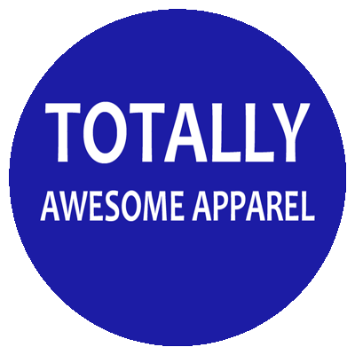

# Capstone-2

## Proposal

### TOTALLY AWESOME APPAREL

Capstone 2 Proposal

Goals -

- Create a simple ecommerce site using the PERN stack (I will also be researching MongoDB while building this, so may convert to MERN, but likely will just stick with Postgresql to save time).  It will have user authentication and protected routes.  There will be a landing page, shop directory, category pages, individual product view and more.  There will be a wishlist, shopping cart and checkout.  Logged in users can see past orders, leave reviews, change user information and preferences, etc.  Basic CMS that allows admin to add/edit/delete products.

- User can sign up, log in, log out, delete account, change account details, add and remove addresses (limit 3, due to Heroku free db limits, could do this with credit cards as well, but since it is test mode of stripe, will just hardcode a test credit card number into the payments page.  Note to user that this is the case).

- User receives an email on signup, password reset request, successful order (with invoice-sends to user in email, then adds to list of previous orders), etc.

- User can view previous orders, but due to the limitations of the free database on Heroku (limited rows), perhaps I will create a JSON file that updates as new orders come in, so the order history shows the history of all users (anonymously) and any logged in user can see all previous orders.  Could also keep orders in local storage, but would prefer if this persists somewhere on the site.  I will decide what to do when I get further into development.

- A user can submit product reviews, and edit or delete their own reviews.  Admin can edit and delete all reviews.  A user can also share a product on social media with share button.

- I would like to make a content management page, and if a user has admin privileges, then they can add items, change item details, etc.  Perhaps putting a toggle for admin to make other users admin, or just log into admin account when showing page to others to prevent too much manipulation of products (could cause problems with Heroku database limitations, or again, keep product data in JSON file).  For people just browsing the site, perhaps in the info/about page I will include a short video about the features of the site, so a casual viewer can get all the info about the site in a short amount of time.  Can contact me if they want to login as admin.

- TBD:

  - ~~Name of site/shop (Have to consider this, especially if I reach stretch goal of multiple languages)~~

  - Color scheme/general design (Could be affected by name and product direction.  Will likely go with minimalistic high contrast color scheme)

  - Products (Most likely will do apparel as free use images in this category are abundant.  May consult others on what they think would be good)

Stretch -

- Multiple languages.  Have option to change between English and Chinese (Stretch).

- Live chat. Have a live chat.  If admin is logged in, can talk with customers, otherwise maybe have some automated responses (Stretch).

- Shipping information. Include dynamic shipping costs in the price (Stretch).

APIs -

- Stripe payments -- will be test (not live) version, as there will be no real products to ship

- Firebase -- connects to user authentication and local storage.  Can sign in with a google account (assuming user is already registered on site).

- Currency converter -- let user select and display local currency (option in the user preferences/profile section).

- Address checker -- check that a shipping address is valid.

This is a work in progress.  I may add to or change certain aspects of this proposal in the future.
