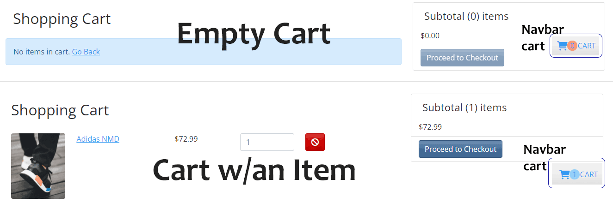

# Totally Awesome Apparel

An ecommerce site using the MERN stack.

This project was completed as part of the Springboard Software Engineering Fellowship Program.

## Table of Contents

1. [Technologies Used](#technologies-used)
    - [Front End](#front-end)
    - [Back End](#back-end)
    - [Database](#database)
    - [API](#api)
    - [Data](#data)
    - [Graphic Design](#graphic-design)
2. [DB Schema and User Flow](#db-schema-and-user-flow)
3. [Deployment](#deployment)
4. [Developer](#developer)
5. [Demo Accounts for Site Use (Regular User/Admin User)](#demo-accounts-for-site-use-regular-useradmin-user)
6. [Features](#features)
    - [Navigation Bar](#navigation-bar)
    - [Cart](#cart)
    - [Registration and Login](#registration-and-login)
    - [Profile and Logout](#profile-and-logout)
    - [Admin](#admin)
    - [Search](#search)
    - [Categories and Directory](#categories-and-directory)
    - [Top Rated Products](#top-rated-products)
    - [Products and Reviews](#products-and-reviews)
    - [Checkout](#checkout)
    - [Footer](#footer)
    - [Misc.](#misc)
7. [Further Steps](#further-steps)
8. [Local Deployment](#local-deployment)
9. [Testing](#testing)

## Technologies Used

---

#### Front End:

React, HTML, SASS, BootStrap, JavaScript, Various NPM modules (See package.json for more details).

#### Back End:

Express, Node, Various NPM modules (See package.json for more details).

#### Database:

MongoDB

#### API:

I used a custom API for this project.  It handles products, users and reviews using CRUD.  Products are handled with a custom CMS (Content Management System) I built that can be accessed using an Admin account.  Users are handled with CMS as well, and anyone can create a new account (one per email).  An admin has the ability to give or take away admin privileges from other users.  Reviews can be made by any user that is logged in and has 'purchased' a product.

#### Data:

A seed file is used to create a list of sample products, and a couple of user accounts (1 admin, 2 users).

#### Graphic Design:

Photoshop and Illustrator were used to create and/or optimize images used on this site.  I have purchased the rights to all product images used.

## DB Schema and User Flow

---

<!--  -->

## Deployment

---

<!-- This app is currently deployed on Heroku at  -->

## Developer

---
### [Jeremy Threlfall](https://github.com/SUBstylee)

---

[LinkedIn](https://www.linkedin.com/in/jeremy-threlfall/)

Email: [jjthrelfall@gmail.com](mailto:jjthrelfall@gmail.com)

## Demo Accounts for Site Use (Regular User/Admin User)

---

This app uses User Registration and Login with Authentication to gain access to a few features such as User Profile, Reviews, and (Mock) Purchases.  A user must be authorized as an Admin to gain access to CMS that handles products and users.  All other routes are unprotected and open to any user who visits the site.

If you do not wish to create an account, you can use the login information below:

Normal User
- Email: bob@bob.com
- Password: 123456

Admin User
- Email: admin@admin.com
- Password: 123456

## Features

---

### Navigation Bar

The navbar will change depending on user.

---

### Cart

The cart link on the navbar will take you to the cart page.  The navbar cart will show the number of items in the cart.

---

### Registration and Login

The signup page lets a user register.  An email address can only have one account connected to it.  There is also a password generator here that gives the user a random password to use.  Use of the password generator is not required, so a user can use any password they desire.

This is the login page.  Pretty straight forward.

---

### Profile and Logout

PROFILE will bring a user to their profile page.

LOGOUT will bring a user back to the sign in page.

PROFILE - Here a user can change their profile details and see their past orders.

---

### Admin

Logged in admin gets access to admin links in navbar.

Admin can see full list of users.  Actions are 'edit' and 'delete'

Admin can edit users name and email address (no access to password, but could easily change this) and give a user admin status.

Admin can see full list of products.  Actions are 'edit' and 'delete'.  A user can also create a new product.

Admin can edit an existing product.  Creating a new product also will bring you to this page.

Admin can see a full list of orders that have been placed.  They can also see if order has been paid.

Admin can see details for individual orders.  If an order has been paid, an admin can change to delivered.

---

### Search

The search icon on the navbar expands out when clicked.

Searching will load a page with all items matching your search term.

Searching for a term that does not match any items will inform you of this.

---

### Categories and Directory

On the navbar (persistent on every page) there are links to categories (hats,shoes,etc.).

On the home page there is a directory with an image with text overlay that links to each category.  There is also an animation that occurs when you hover over them.

---

### Top Rated Products

On the home page, there is a carousel (rotates on a loop) of the 5 top rated products.  This is dynamic depending on which products have best reviews (most stars).

---

### Products and Reviews

Users will see a list of all products (with pagination) in a section.

Users will see details on any individual product they choose.

A user must be logged in before the option to leave a review is available.

A user can only leave one review per product.

A user can only leave reviews for products they have already 'purchased'.

---

### Checkout

User must have at least one item in their cart for the 'Proceed to Checkout' button to work.

A signed in user will be brought to the shipping information page (otherwise they will be brought to the sign in page).

Next, they must pick a payment method.

Next, they can review their order and make any necessary changes.

After confirming their order, they must make the payment.

After payment is confirmed, an admin can change their order to delivered (should be shipped but going to keep it as is).

---

### Footer

At the bottom of every page is a simple footer.  The links here go to my github and social media pages.

---

### Misc.

There are a few other items that I won't picture here.
- custom inputs
- custom loaders
- pagination
- custom 'toast' style notifications
- a few others that you will see if you navigate the site...

---

## Further Steps

Here are a few things that could be added to make the site even better.  I am however done with this project for now, so likely will not be adding any of these anytime soon.

- Multiple languages.  Have option to change between English and Chinese.
- Live chat. Have a live chat.  If admin is logged in, can talk with customers, otherwise maybe have some automated responses.
- Shipping information. Include dynamic shipping costs in the price.
- Firebase -- Can sign in with a google account.
- Currency converter -- let user select and display their preferred currency (option in the user preferences/profile section).
- Address checker -- check that a shipping address is valid.

## Local Deployment

Clone the repository, enter directory of repo, and use `npm i` to install all dependencies.

You must create a `.env` file in the root folder (see above image).  Put your own info in for:
- MONGO_URI - this is the location of your database
- JWT_SECRET - secret word for JSON WEB TOKEN
- PAYPAL_CLIENT_ID - you need to get this from your paypal account, make sure you use test/sandbox
- SECRET_KEY - you need to get this from your stripe account, make sure you use test/sandbox

You can now seed the database by typing `npm data:import`

Finally, you can run both the backend and frontend at the same time by typing `npm run dev`

## Testing

All tests written for and to be ran with react-testing-library.

